# 2gthr Platform - System Overview

> **Document Purpose**: Executive summary of the 2gthr platform for non-technical stakeholders
> **Last Updated**: February 2026
> **Version**: POC (Proof of Concept)

---

## 1. What is 2gthr?

**2gthr** is an **AI-powered professional development platform** that helps users build evidence of their skills and achievements to advance their careers.

### The Problem It Solves

Many professionals struggle to document and present their accomplishments effectively. When it comes time for a promotion, job search, or performance review, they find themselves unable to recall or prove their achievements. 2gthr solves this by providing:

- **Structured learning paths** that guide users through professional development
- **AI-powered tools** that help document and articulate achievements
- **Evidence collection** capabilities to build a portfolio of proof
- **CV enhancement** using artificial intelligence to improve resumes

### The User Experience

A typical user journey looks like this:

1. **Sign up** and complete a brief onboarding questionnaire
2. **Discover** learning paths relevant to their career goals (e.g., "Land Your Next Job", "Build Your Evidence Portfolio")
3. **Progress** through bite-sized activities called "Go-Cards" - articles to read, quizzes, reflections, and interactive tools
4. **Earn rewards** ("Strides" points and badges) as they complete activities
5. **Build evidence** by uploading documents, receiving AI analysis, and generating professional materials
6. **Track progress** via a personal dashboard ("My DNA")

---

## 2. Major Features & How They Connect

### Core User Features

| Feature | Description | Value to User |
|---------|-------------|---------------|
| **Learning Paths** | Structured journeys with milestones and activities | Guided professional development |
| **Go-Cards** | Individual learning activities (12+ types: articles, quizzes, tools, etc.) | Bite-sized, engaging learning |
| **CV Builder** | AI-powered resume analysis and improvement | Better job applications |
| **Evidence Collection** | Upload documents, get AI analysis | Proof of achievements |
| **Co-Create** | Guided AI conversations to document achievements | Easier evidence articulation |
| **Insights** | Personalized AI-generated feedback based on responses | Actionable career guidance |
| **Progress Tracking** | Points (Strides), badges, completion status | Motivation and gamification |

### Admin Features

| Feature | Description |
|---------|-------------|
| **Content Management** | Create and edit paths, milestones, and activities |
| **Analytics Dashboard** | View user engagement, popular content, completion rates |
| **User Management** | Control which paths users can access |
| **Content Generator** | AI-assisted content creation from markdown |

### How Features Connect

```
User Signs Up → Completes Onboarding → Browses Discover Page
                                              ↓
                                    Selects a Learning Path
                                              ↓
                               Views Milestones within Path
                                              ↓
                              Engages with Go-Card Activities
                                    ↙        ↓         ↘
                            Articles    Tools/AI     Evidence Upload
                                    ↘        ↓         ↙
                               Progress Saved to Profile
                                              ↓
                                    Earns Strides & Badges
                                              ↓
                              Views Stats on "My DNA" Dashboard
```

---

## 3. Technology Stack

### Overview

2gthr is built on modern cloud infrastructure designed for scalability, security, and rapid development.

### Frontend (What Users See)

| Technology | Purpose |
|------------|---------|
| **React** | User interface framework (industry standard) |
| **Tailwind CSS** | Visual styling and design system |
| **Vite** | Fast development and build tooling |

### Backend (Server & Data)

| Technology | Purpose |
|------------|---------|
| **Firebase** | Google's cloud platform providing: |
| → Firestore | Database (stores all user data, content, progress) |
| → Authentication | User login (email/password, Google sign-in) |
| → Storage | File uploads (evidence documents, images) |
| → Hosting | Website deployment and delivery |
| → Cloud Functions | Server-side processing (AI integrations) |

### Artificial Intelligence

| AI Service | Provider | Purpose |
|------------|----------|---------|
| **Gemini 2.0 Flash** | Google (via Firebase) | Real-time document analysis, insights generation, conversation AI |
| **Claude** | Anthropic | CV analysis and generation, content parsing |

### Third-Party Integrations

| Integration | Purpose |
|-------------|---------|
| **PDF.js** | Extract text from PDF documents |
| **Mammoth** | Extract text from Word documents |
| **Recharts** | Analytics charts and visualizations |
| **html2pdf** | Generate downloadable PDF documents |

---

## 4. Architecture Diagram

```mermaid
flowchart TB
    subgraph Users["👥 Users"]
        Web["Web Browser"]
    end

    subgraph Frontend["Frontend Application"]
        React["React App"]
        Pages["Pages<br/>(Discover, Paths, My DNA)"]
        Components["Components<br/>(Go-Cards, Tools, Admin)"]
    end

    subgraph Firebase["☁️ Firebase Cloud Platform"]
        Auth["🔐 Authentication<br/>(Login, Sign Up)"]
        Firestore["📊 Firestore Database<br/>(Users, Paths, Progress)"]
        Storage["📁 Cloud Storage<br/>(Evidence Files)"]
        Functions["⚡ Cloud Functions<br/>(AI Processing)"]
        Hosting["🌐 Hosting<br/>(Website Delivery)"]
    end

    subgraph AI["🤖 AI Services"]
        Gemini["Google Gemini 2.0<br/>(Document Analysis,<br/>Insights, Co-Create)"]
        Claude["Anthropic Claude<br/>(CV Analysis,<br/>Content Generation)"]
    end

    Web --> Hosting
    Hosting --> React
    React --> Pages
    Pages --> Components

    Components --> Auth
    Components --> Firestore
    Components --> Storage
    Components --> Functions

    Functions --> Claude
    Components --> Gemini

    style Users fill:#e1f5fe
    style Frontend fill:#fff3e0
    style Firebase fill:#e8f5e9
    style AI fill:#fce4ec
```



### Data Flow Summary

1. **Users** access the platform through their web browser
2. **Firebase Hosting** delivers the React application
3. **React** handles the user interface and interactions
4. **Firestore** stores all data (users, content, progress)
5. **Cloud Storage** holds uploaded evidence files
6. **Cloud Functions** process AI requests securely
7. **AI Services** (Gemini & Claude) provide intelligent features

---

## 5. Key Metrics & Scale

### Current State (POC)

- **2 Learning Paths** available ("Evidence Deficit", "Land Your Next Job")
- **6 Milestones** per path (12 total)
- **29+ Go-Cards** (individual activities)
- **12 Activity Types** supported (articles, quizzes, tools, evidence, etc.)
- **5 Life Dimensions** (Career, Health, Learning, Relationships, Finance)

### Technical Capacity

- **Database**: Firestore scales automatically to millions of users
- **Storage**: Unlimited file storage capacity
- **AI Processing**: On-demand, pay-per-use pricing
- **Hosting**: Global CDN with auto-scaling

---

## 6. Security & Privacy

| Aspect | Implementation |
|--------|----------------|
| **Authentication** | Industry-standard Firebase Auth with optional Google sign-in |
| **Data Encryption** | All data encrypted in transit (HTTPS) and at rest |
| **Access Control** | Role-based permissions (user vs admin) |
| **Path Restrictions** | Users only see paths they're authorized to access |
| **AI Privacy** | Documents processed by AI are not stored by AI providers |

---

## 7. Summary

**2gthr** is a modern, AI-powered professional development platform that:

- Guides users through **structured learning journeys**
- Uses **artificial intelligence** to analyze documents and generate insights
- Helps users **build evidence portfolios** of their achievements
- Provides **CV enhancement** through AI analysis
- Delivers a **gamified experience** with points and badges
- Runs on **scalable cloud infrastructure** (Firebase)
- Includes **admin tools** for content management and analytics

The platform is currently in **proof-of-concept stage**, demonstrating core functionality and AI integrations with room to expand content and features based on user feedback.

---

*Report generated for executive review. For technical implementation details, see the codebase documentation.*
