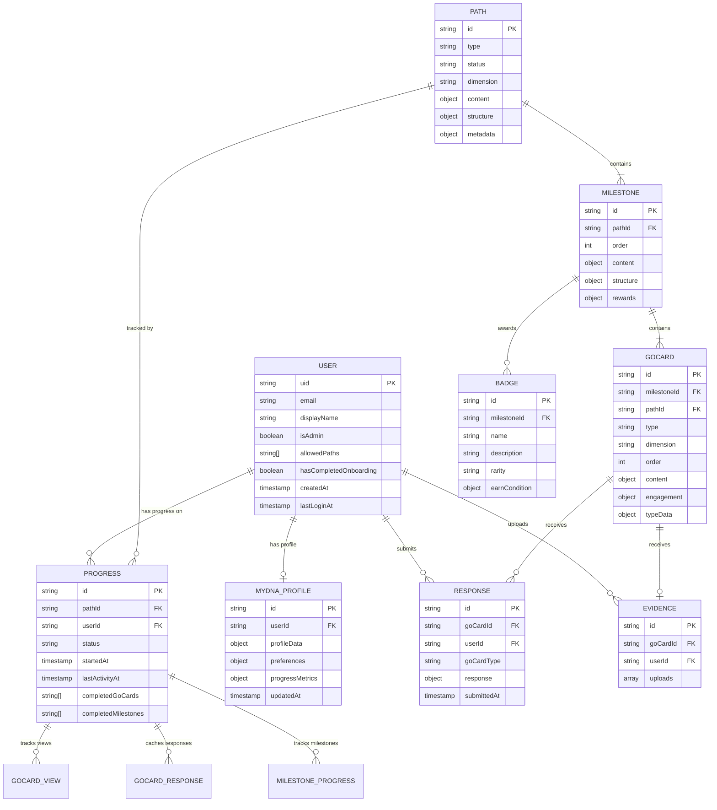

# 2gthr Frontend Portability Report

> **Document Purpose**: Technical analysis for Accenture handover—how to separate frontend from Firebase backend
> **Last Updated**: February 2026
> **Version**: POC Analysis

---

## Executive Summary

The 2gthr frontend is **highly portable** due to its clean service-layer abstraction. All Firebase operations are isolated in dedicated service files, making backend replacement straightforward. This document details the current architecture, data contracts, and migration requirements.

---

## Part A: Frontend/Backend Separation Analysis

### Current Architecture

```
┌─────────────────────────────────────────────────────────────────────┐
│                        React Frontend (Vite)                        │
├─────────────────────────────────────────────────────────────────────┤
│  Pages          │  Components       │  Context                      │
│  - Discover     │  - Go-Cards       │  - AuthContext                │
│  - PathPage     │  - ArticleCard    │  - (global state)             │
│  - MilestonePage│  - QuizCard       │                               │
│  - MyDNA        │  - ToolCard       │                               │
│  - Admin/*      │  - Evidence*      │                               │
└────────┬────────┴────────┬──────────┴────────┬──────────────────────┘
         │                 │                   │
         ▼                 ▼                   ▼
┌─────────────────────────────────────────────────────────────────────┐
│                     Service Layer (Abstraction)                      │
├──────────────┬──────────────┬──────────────┬───────────────────────┤
│ firestore.js │   auth.js    │ aiService.js │  evidenceService.js   │
│ cvService.js │myDNAService.js│responseService│  progressService.js  │
└──────┬───────┴──────┬───────┴──────┬───────┴───────────┬───────────┘
       │              │              │                   │
       ▼              ▼              ▼                   ▼
┌─────────────────────────────────────────────────────────────────────┐
│                    Firebase Backend (Current)                        │
│  Firestore │ Auth │ Storage │ Cloud Functions │ Vertex AI (Gemini)  │
└─────────────────────────────────────────────────────────────────────┘
```

### Service Layer Files (The Abstraction Point)

| Service File | Firebase Dependency | Portability Notes |
|-------------|---------------------|-------------------|
| `firebase.js` | **Core** - initializes Firebase | Replace with new backend SDK init |
| `firestore.js` | Firestore | 858 lines of CRUD - all queries abstracted |
| `auth.js` | Firebase Auth | Clean interface for auth operations |
| `evidenceService.js` | Storage + Firestore | File uploads + metadata |
| `cvService.js` | Cloud Functions | Calls serverless functions |
| `aiService.js` | Vertex AI (Gemini) | AI model configuration |
| `responseService.js` | Firestore | User response storage |
| `myDNAService.js` | Firestore | User profile management |
| `progressService.js` | **None** | Pure JavaScript logic - fully portable |
| `badgeService.js` | **None** | Pure JavaScript logic - fully portable |
| `stridesService.js` | **None** | Pure JavaScript logic - fully portable |
| `adminService.js` | Firestore | Admin role checking |

### Pure Logic Services (Zero Changes Needed)

These services contain no Firebase imports and are immediately portable:

1. **`progressService.js`** - Jump Back In logic, recommendations, metrics calculation
2. **`badgeService.js`** - Badge earning conditions evaluation
3. **`stridesService.js`** - Points/rewards calculation

### Clean Separation Strategy

To make the frontend fully portable:

**Step 1: Create Interface Definitions**
```javascript
// src/services/interfaces/IAuthService.js
export interface IAuthService {
  signUpWithEmail(email, password, name): Promise<User>
  signInWithEmail(email, password): Promise<User>
  signInWithGoogle(): Promise<User>
  signOut(): Promise<void>
  onAuthStateChange(callback): Unsubscribe
  getCurrentUser(): User | null
}
```

**Step 2: Create Backend Adapters**
```javascript
// src/services/adapters/firebase/AuthAdapter.js
import { auth } from './firebase';
// ... implements IAuthService using Firebase

// src/services/adapters/accenture/AuthAdapter.js
import { AccentureAuth } from '@accenture/auth-sdk';
// ... implements IAuthService using Accenture backend
```

**Step 3: Dependency Injection**
```javascript
// src/services/index.js
const BACKEND = import.meta.env.VITE_BACKEND || 'firebase';
export const authService = BACKEND === 'firebase'
  ? new FirebaseAuthAdapter()
  : new AccentureAuthAdapter();
```

---

## Part B: Data Structures & Entity Relationship Diagram

### Core Entities

#### 1. User
```typescript
interface User {
  uid: string                    // Primary key (Firebase Auth UID)
  email: string
  displayName: string
  photoURL?: string
  isAdmin: boolean
  allowedPaths: string[]         // Access control
  hasCompletedOnboarding: boolean
  createdAt: Timestamp
  lastLoginAt: Timestamp
  onboardingData?: {
    firstName: string
    lastName: string
    lifeStage: string
    interests: string[]
    goals: string[]
  }
}
```

#### 2. Path (Learning Journey)
```typescript
interface Path {
  id: string                     // e.g., "path-evidence-deficit"
  type: 'aspiration' | 'skill' | 'challenge'
  status: 'active' | 'draft' | 'archived'
  dimension: 'career' | 'health' | 'learning' | 'relationships' | 'finance'
  content: {
    title: string
    subtitle: string
    description: string
    heroImage: string
    tags: string[]
    cpdPoints?: number
  }
  structure: {
    milestoneIds: string[]
    estimatedDuration: string
    difficulty: 'beginner' | 'intermediate' | 'advanced'
    dependencies: { mode: 'open' | 'sequential' }
  }
  metadata: {
    createdAt: Timestamp
    targetStages: string[]
  }
  // Denormalized for performance
  milestoneSummaries?: MilestoneSummary[]
}
```

#### 3. Milestone
```typescript
interface Milestone {
  id: string                     // e.g., "milestone-1"
  pathId: string                 // Foreign key to Path
  order: number
  content: {
    title: string
    description: string
    outcomes: string[]
  }
  structure: {
    goCardIds: string[]
    estimatedDuration: string
    isEssential: boolean
    goCardDependencies: { mode: 'open' | 'sequential' }
    completionRequirements: { type: 'all-cards' | 'percentage', value?: number }
  }
  rewards: {
    strides: number
    badge?: string
  }
  badges?: Badge[]               // Embedded badges for this milestone
}
```

#### 4. GoCard (Learning Activity)
```typescript
interface GoCard {
  id: string                     // e.g., "gocard-1-1"
  milestoneId: string           // Foreign key to Milestone
  pathId?: string               // Optional direct path reference
  type: GoCardType              // See types below
  dimension: string
  order: number
  sequencePosition?: number
  content: {
    title: string
    subtitle: string
    description: string
    thumbnail: string
  }
  engagement: {
    estimatedTime: string
    difficulty: 'easy' | 'medium' | 'hard'
    strides: number
    isEssential: boolean
  }
  typeData: TypeSpecificData    // Varies by type
}

type GoCardType =
  | 'article'     // Long-form content with blocks
  | 'quiz'        // Multiple-choice questions with scoring
  | 'reflection'  // Open-ended prompts
  | 'checklist'   // Trackable items with optional evidence
  | 'tool'        // Interactive components (CV Builder, etc.)
  | 'media'       // Video/audio content
  | 'event'       // Calendar events with registration
  | 'evidence'    // File upload with AI analysis
  | 'co-create'   // AI-guided conversation
  | 'insights'    // AI-generated personalized feedback
```

#### 5. Progress (User Progress on Path)
```typescript
interface Progress {
  id: string                     // pathId (document ID in subcollection)
  pathId: string
  userId: string                 // Parent document reference
  status: 'not-started' | 'in-progress' | 'completed'
  startedAt: Timestamp
  completedAt?: Timestamp
  lastActivityAt: Timestamp

  // Completed items
  completedGoCards: string[]
  completedMilestones: string[]

  // Milestone-level progress
  milestones: {
    [milestoneId: string]: {
      status: 'not-started' | 'in-progress' | 'completed'
      startedAt?: Timestamp
      completedAt?: Timestamp
      lastActivityAt?: Timestamp
      order?: number
      title?: string              // Denormalized
      strides?: number            // Denormalized
    }
  }

  // Go-card views (for "Jump Back In")
  goCardViews?: {
    [goCardId: string]: {
      lastViewedAt: Timestamp
      viewCount: number
      title?: string              // Denormalized
      thumbnail?: string          // Denormalized
      type?: string               // Denormalized
      dimension?: string
      milestoneId?: string
    }
  }

  // Quiz/reflection responses (denormalized for quick access)
  goCardResponses?: {
    [goCardId: string]: {
      response: any
      scorePercent?: number
      submittedAt: Timestamp
    }
  }
}
```

#### 6. Response (User Go-Card Responses)
```typescript
interface Response {
  id: string                     // goCardId (document ID in subcollection)
  goCardId: string
  goCardType: string
  pathId?: string
  milestoneId?: string
  response: any                  // Type-specific response data
  submittedAt: Timestamp
  updatedAt?: Timestamp
}
```

#### 7. Evidence (Uploaded Evidence Files)
```typescript
interface Evidence {
  id: string                     // goCardId (document ID in subcollection)
  goCardId: string
  userId: string
  uploads: EvidenceUpload[]
}

interface EvidenceUpload {
  uploadId: string
  fileName: string
  fileUrl: string
  fileType: string
  fileSize: number
  uploadedAt: Timestamp
  analysis?: {
    summary: string
    keyPoints: string[]
    suggestions: string[]
    rawResponse?: string
  }
  freshness?: {
    status: 'fresh' | 'needs-review' | 'stale'
    lastReviewedAt?: Timestamp
    expiresAt?: Timestamp
  }
}
```

#### 8. MyDNA Profile
```typescript
interface MyDNAProfile {
  id: 'profile'                  // Fixed document ID
  profileData: {
    basics: {
      name: string
      email: string
      phone: string
      location: string
      linkedIn: string
    }
    work: {
      currentRole: string
      company: string
      yearsExperience: number
      history: WorkHistory[]
    }
    education: Education[]
    skills: {
      technical: string[]
      soft: string[]
      languages: string[]
    }
    goals: {
      career: string[]
      learning: string[]
      personal: string[]
    }
  }
  preferences: {
    notifications: boolean
    privacy: 'public' | 'private'
    theme: 'light' | 'dark'
  }
  progressMetrics: {
    totalStrides: number
    pathsStarted: number
    pathsCompleted: number
    cardsCompleted: number
    longestStreak: number
    currentStreak: number
    lastActive: Timestamp
  }
  createdAt: Timestamp
  updatedAt: Timestamp
}
```

#### 9. Badge
```typescript
interface Badge {
  id: string
  name: string
  description: string
  icon: string
  rarity: 'common' | 'rare' | 'epic' | 'legendary'
  earnCondition: {
    type: 'card-completed' | 'quiz-score' | 'evidence-criteria-met' |
          'all-cards-of-type' | 'milestone-complete' | 'path-complete'
    goCardId?: string
    minScore?: number
    types?: string[]
  }
}
```

### Entity Relationship Diagram (Mermaid)



### Firestore Collection Structure

```
firestore/
├── users/
│   └── {userId}/
│       ├── (user document)
│       ├── progress/
│       │   └── {pathId}       # Progress document
│       ├── responses/
│       │   └── {goCardId}     # Response document
│       ├── evidence/
│       │   └── {goCardId}     # Evidence document
│       └── myDNA/
│           └── profile        # Single profile document
├── paths/
│   └── {pathId}               # Path document
├── milestones/
│   └── {milestoneId}          # Milestone document
└── gocards/
    └── {goCardId}             # GoCard document
```

---

## Part C: API Contracts & Endpoints

### Authentication API

| Function | Signature | Current Implementation |
|----------|-----------|----------------------|
| `signUpWithEmail` | `(email, password, name) → Promise<{user, error}>` | Firebase Auth `createUserWithEmailAndPassword` |
| `signInWithEmail` | `(email, password) → Promise<{user, error}>` | Firebase Auth `signInWithEmailAndPassword` |
| `signInWithGoogle` | `() → Promise<{user, error}>` | Firebase Auth `signInWithPopup` |
| `signOut` | `() → Promise<void>` | Firebase Auth `signOut` |
| `onAuthStateChange` | `(callback) → Unsubscribe` | Firebase Auth `onAuthStateChanged` |
| `createUserDocument` | `(user) → Promise<void>` | Creates user doc in Firestore |

**Request/Response Shapes:**

```typescript
// signUpWithEmail
Request: { email: string, password: string, name: string }
Response: { user: User | null, error: Error | null }

// signInWithEmail
Request: { email: string, password: string }
Response: { user: User | null, error: Error | null }

// signInWithGoogle
Request: (none)
Response: { user: User | null, error: Error | null }
```

### Content API (Paths, Milestones, Go-Cards)

| Function | Signature | Notes |
|----------|-----------|-------|
| `getPaths` | `() → Promise<Path[]>` | Filters by status='active' |
| `getPath` | `(pathId) → Promise<Path>` | Single path with milestoneSummaries |
| `getMilestones` | `(pathId?) → Promise<Milestone[]>` | Optional filter by pathId |
| `getMilestone` | `(milestoneId) → Promise<Milestone>` | Single milestone |
| `getGoCards` | `(milestoneId?) → Promise<GoCard[]>` | Optional filter by milestoneId |
| `getGoCard` | `(goCardId) → Promise<GoCard>` | Single go-card |
| `getGoCardsForPath` | `(pathId) → Promise<GoCard[]>` | All cards in a path |

**Response Shape Examples:**

```typescript
// getPaths response
[
  {
    id: "path-evidence-deficit",
    type: "aspiration",
    status: "active",
    dimension: "career",
    content: {
      title: "Evidence Deficit",
      subtitle: "Build a compelling portfolio...",
      description: "Learn how to identify...",
      heroImage: "https://...",
      tags: ["Career Growth", "Portfolio"],
      cpdPoints: 15
    },
    structure: {
      milestoneIds: ["milestone-1", "milestone-2", ...],
      estimatedDuration: "4-6 weeks",
      difficulty: "beginner",
      dependencies: { mode: "open" }
    }
  }
]
```

### Progress API

| Function | Signature | Notes |
|----------|-----------|-------|
| `getUserProgress` | `(userId, pathId) → Promise<Progress>` | Single path progress |
| `getAllUserProgress` | `(userId) → Promise<Progress[]>` | All paths progress |
| `startPath` | `(userId, pathId, pathTitle?) → Promise<void>` | Initializes progress doc |
| `recordGoCardView` | `(userId, pathId, goCardId, metadata) → Promise<void>` | Tracks view with denormalized data |
| `updateGoCardCompletion` | `(userId, pathId, goCardId, milestoneId, response?) → Promise<{success, error}>` | Marks card complete |
| `updateMilestoneProgress` | `(userId, pathId, milestoneId, status) → Promise<void>` | Updates milestone status |

**Payload Shapes:**

```typescript
// recordGoCardView
{
  userId: string,
  pathId: string,
  goCardId: string,
  metadata: {
    title?: string,
    thumbnail?: string,
    type?: string,
    dimension?: string,
    milestoneId?: string
  }
}

// updateGoCardCompletion response
{ success: boolean, error?: string }
```

### Response API

| Function | Signature | Notes |
|----------|-----------|-------|
| `saveGoCardResponse` | `(userId, goCardId, goCardType, response, pathId?, milestoneId?) → Promise<void>` | Saves user response |
| `getGoCardResponse` | `(userId, goCardId) → Promise<Response>` | Retrieves saved response |
| `getAllUserResponses` | `(userId) → Promise<Response[]>` | All user responses |
| `getResponsesForPath` | `(userId, pathId) → Promise<Response[]>` | Responses filtered by path |

### Evidence API

| Function | Signature | Notes |
|----------|-----------|-------|
| `uploadEvidenceFile` | `(userId, goCardId, file) → Promise<{url, path}>` | Uploads to Storage |
| `deleteEvidenceFile` | `(storagePath) → Promise<void>` | Removes from Storage |
| `saveEvidenceUpload` | `(userId, goCardId, uploadData) → Promise<void>` | Saves metadata to Firestore |
| `getEvidenceRecord` | `(userId, goCardId) → Promise<Evidence>` | Retrieves evidence record |
| `updateEvidenceFreshness` | `(userId, goCardId, uploadId, freshness) → Promise<void>` | Updates staleness status |
| `updateUploadAnalysis` | `(userId, goCardId, uploadId, analysis) → Promise<void>` | Saves AI analysis |

**Upload Payload:**

```typescript
{
  uploadId: string,
  fileName: string,
  fileUrl: string,
  fileType: string,
  fileSize: number,
  uploadedAt: Timestamp
}
```

### CV Service API (Cloud Functions)

| Function | Signature | Backend |
|----------|-----------|---------|
| `analyzeCV` | `(cvText, userContext?) → Promise<CVAnalysis>` | Cloud Function → Claude API |
| `generateCV` | `(existingCV, userResponses, targetRole?) → Promise<GeneratedCV>` | Cloud Function → Claude API |

**Payload Shapes:**

```typescript
// analyzeCV request
{
  cvText: string,
  userContext?: {
    targetRole?: string,
    industry?: string
  }
}

// analyzeCV response
{
  overallScore: number,
  strengths: string[],
  weaknesses: string[],
  suggestions: string[],
  missingElements: string[],
  sareAnalysis: {
    situations: number,
    actions: number,
    results: number,
    evidence: number
  }
}

// generateCV response
{
  markdown: string,
  html: string,
  sections: {
    summary: string,
    experience: WorkExperience[],
    skills: string[],
    education: Education[]
  }
}
```

### AI Service API (Client-side Gemini)

| Function | Signature | Notes |
|----------|-----------|-------|
| `getInsightsModel` | `() → GenerativeModel` | Gemini 2.0 Flash for insights |
| `getDocumentAnalysisModel` | `() → GenerativeModel` | Gemini for document analysis |

**Usage Pattern:**

```typescript
const model = getInsightsModel();
const result = await model.generateContent({
  contents: [{ role: 'user', parts: [{ text: prompt }] }],
  generationConfig: {
    responseMimeType: 'application/json',
    responseSchema: InsightsSchema
  }
});
```

### MyDNA Profile API

| Function | Signature | Notes |
|----------|-----------|-------|
| `getUserProfile` | `(userId) → Promise<MyDNAProfile>` | Creates if doesn't exist |
| `initializeMyDNA` | `(userId, initialData?) → Promise<MyDNAProfile>` | Creates default profile |
| `updateProfileField` | `(userId, fieldPath, value) → Promise<void>` | Dot-notation path updates |
| `updateProfileFields` | `(userId, updates) → Promise<void>` | Batch field updates |
| `updateProgressMetrics` | `(userId, metrics) → Promise<void>` | Updates progress section |
| `populateProfileFromCard` | `(userId, cardType, responseData) → Promise<void>` | Auto-populates from responses |

### Admin API

| Function | Signature | Notes |
|----------|-----------|-------|
| `checkIsAdmin` | `(userId) → Promise<boolean>` | Checks isAdmin flag |
| `setAdminStatus` | `(userId, isAdmin) → Promise<void>` | Sets admin flag |

---

## Part D: Portability Assessment

### Already Clean (No Changes Needed)

| Component | Reason |
|-----------|--------|
| All React pages | No direct Firebase imports |
| All UI components | Pure presentational |
| `progressService.js` | Pure JavaScript logic |
| `badgeService.js` | Pure JavaScript logic |
| `stridesService.js` | Pure JavaScript logic |
| Routing (React Router) | Framework-independent |
| Styling (Tailwind CSS) | Framework-independent |
| Build system (Vite) | Framework-independent |

### Requires Adapter Pattern (Medium Effort)

| Service | Current | Migration Strategy |
|---------|---------|-------------------|
| `auth.js` | Firebase Auth | Create auth adapter interface |
| `firestore.js` | Firestore | Create data access interface |
| `evidenceService.js` | Storage + Firestore | Create storage adapter |
| `responseService.js` | Firestore | Include in data access interface |
| `myDNAService.js` | Firestore | Include in data access interface |
| `adminService.js` | Firestore | Include in data access interface |

### Requires Backend Replacement (Higher Effort)

| Service | Current | Migration Notes |
|---------|---------|----------------|
| `cvService.js` | Cloud Functions (Claude) | Need equivalent serverless or API endpoint |
| `aiService.js` | Vertex AI (Gemini) | Can keep Gemini or switch to Azure OpenAI |
| Firebase Hosting | Firebase | Move to Azure/AWS/Vercel |

### Migration Checklist

#### Phase 1: Prepare Interfaces
- [ ] Define `IAuthService` interface
- [ ] Define `IDataService` interface (covers all Firestore operations)
- [ ] Define `IStorageService` interface
- [ ] Define `IAIService` interface
- [ ] Define `ICVService` interface

#### Phase 2: Create Adapters
- [ ] Create Firebase adapters (current implementation)
- [ ] Create Accenture adapters (new backend)
- [ ] Add environment-based adapter selection

#### Phase 3: Update Imports
- [ ] Update all service imports to use adapter factory
- [ ] Test with Firebase adapters (no functional change)
- [ ] Test with Accenture adapters

#### Phase 4: Backend Migration
- [ ] Set up Accenture authentication system
- [ ] Set up Accenture database (SQL or NoSQL)
- [ ] Set up file storage (Azure Blob, S3, etc.)
- [ ] Deploy CV analysis endpoint
- [ ] Configure AI service (Azure OpenAI or keep Gemini)

### Estimated Effort

| Task | Effort | Dependencies |
|------|--------|--------------|
| Interface definitions | 2-3 days | None |
| Adapter pattern implementation | 5-7 days | Interfaces |
| Accenture auth adapter | 3-5 days | Auth system specs |
| Accenture data adapter | 5-7 days | Database schema |
| Accenture storage adapter | 2-3 days | Storage specs |
| CV service migration | 3-5 days | API endpoint |
| Testing & validation | 5-7 days | All adapters |
| **Total** | **25-37 days** | |

---

## Appendix: Environment Variables

Current Firebase configuration (to be replaced):

```env
VITE_FIREBASE_API_KEY=
VITE_FIREBASE_AUTH_DOMAIN=
VITE_FIREBASE_PROJECT_ID=
VITE_FIREBASE_STORAGE_BUCKET=
VITE_FIREBASE_MESSAGING_SENDER_ID=
VITE_FIREBASE_APP_ID=
VITE_FIREBASE_MEASUREMENT_ID=

# Cloud Functions
ANTHROPIC_API_KEY=             # For Claude (CV analysis)
```

Future Accenture configuration (example):

```env
VITE_BACKEND=accenture
VITE_ACCENTURE_API_BASE_URL=
VITE_ACCENTURE_AUTH_ENDPOINT=
VITE_ACCENTURE_CLIENT_ID=
VITE_AZURE_OPENAI_ENDPOINT=    # Or keep Gemini
VITE_AZURE_OPENAI_KEY=
```

---

## Conclusion

The 2gthr frontend is **well-architected for portability**. The service layer provides a clean abstraction over Firebase, and the pure-logic services require zero changes.

**Key strengths:**
- All Firebase operations isolated in service files
- No Firebase imports in pages or UI components
- Pure JavaScript logic for progress, badges, and strides
- Clean data model with clear relationships

**Migration path:**
1. Define service interfaces
2. Implement adapter pattern
3. Create Accenture-specific adapters
4. Switch via environment configuration

With approximately 25-37 days of engineering effort, the frontend can be fully decoupled from Firebase and connected to any backend that implements the defined interfaces.

---

*Report generated for Accenture technical review. For implementation details, see the source code in `src/services/`.*
