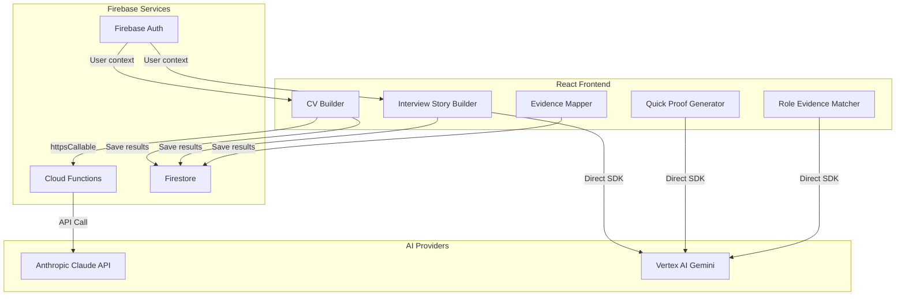
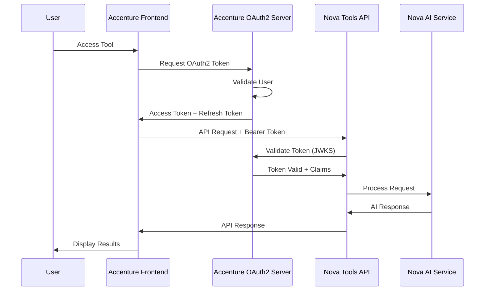
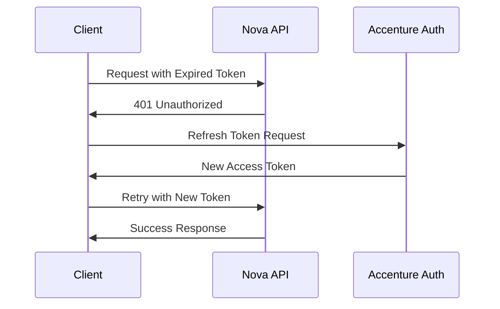
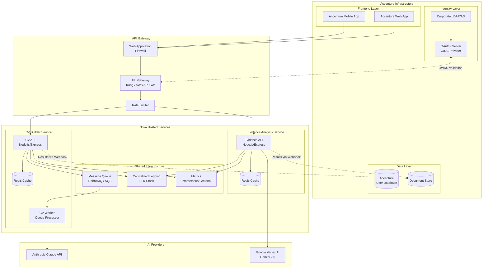
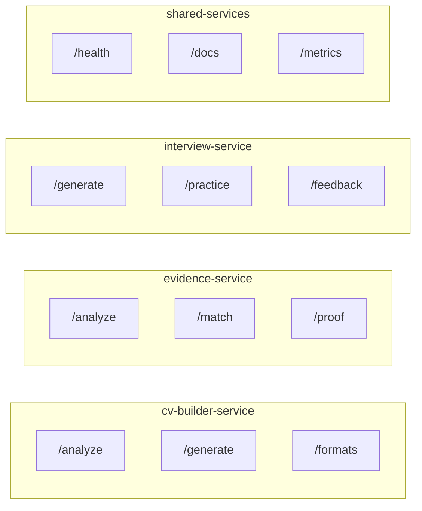
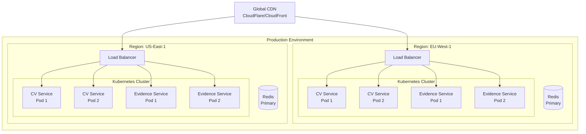
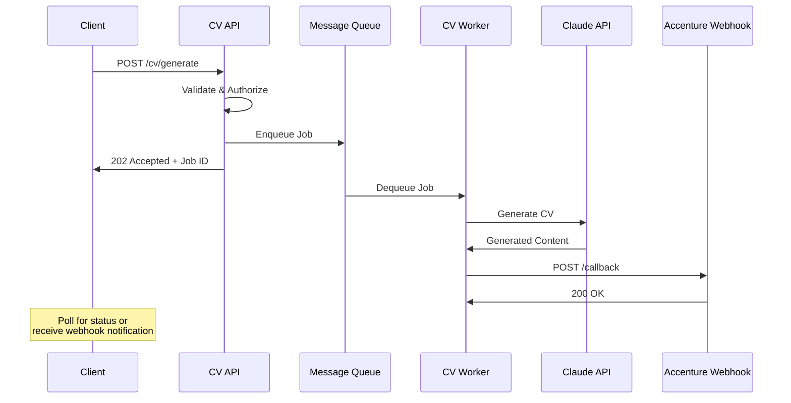

# Hosted Tools Architecture Report

**Generated:** 2026-02-13
**Purpose:** Define how interactive tools can be hosted independently and integrated with Accenture's systems via secure microservices.

---

## Table of Contents

1. [Executive Summary](#executive-summary)
2. [Independently Hostable Tools](#independently-hostable-tools)
3. [Data Flows & Dependencies](#data-flows--dependencies)
4. [OAuth2 & REST API Integration](#oauth2--rest-api-integration)
5. [Security Controls](#security-controls)
6. [Microservice Architecture](#microservice-architecture)
7. [Implementation Roadmap](#implementation-roadmap)

---

## Executive Summary

This document outlines how Nova's interactive tools can be extracted from the current monolithic React application and hosted as independent microservices. This architecture enables:

- **White-label deployment** within Accenture's infrastructure
- **Data sovereignty** compliance through isolated service boundaries
- **Scalable AI workloads** separated from the main application
- **Secure data exchange** via OAuth2 and encrypted REST APIs

### Key Findings

| Tool | AI Dependency | Hosting Complexity | Data Sensitivity |
|------|--------------|-------------------|------------------|
| CV Builder | Claude API (Cloud Functions) | Medium | High (PII) |
| Interview Story Builder | Vertex AI (Gemini) | Medium | Medium |
| Quick Proof Generator | Vertex AI (Gemini) | Low | Medium |
| Role Evidence Matcher | Vertex AI (Gemini) | Low | Low |
| Evidence Mapper | None (client-side) | Low | Low |

---

## Independently Hostable Tools

### 1. CV Builder Tool

**Current Location:** `src/components/go-cards/tools/CVBuilder.jsx` (858 lines)

**Description:** Multi-step CV analysis and generation wizard with AI-powered feedback.

**Phases:**
1. **Upload** - PDF/DOCX parsing via pdfjs-dist and mammoth
2. **Analysis** - Claude API evaluates CV against S→A→R→E framework
3. **Improve** - User responds to follow-up questions
4. **Download** - Claude generates improved CV in multiple formats

**Current Dependencies:**
```javascript
// Firebase Cloud Functions
import { getFunctions, httpsCallable } from 'firebase/functions';

const analyzeCV = httpsCallable(functions, 'analyzeCV');
const generateCV = httpsCallable(functions, 'generateCV');
```

**AI Provider:** Anthropic Claude API (`claude-sonnet-4-20250514`) via Cloud Functions

**Data Handled:**
- CV text content (PII: names, contact info, work history)
- Job descriptions
- Analysis results (strengths, gaps, extracted data)
- Generated CV output

**Hosting Recommendation:** **Dedicated microservice** with isolated PII handling

---

### 2. Interview Story Builder

**Current Location:** `src/components/go-cards/tools/InterviewStoryBuilder/InterviewStoryBuilder.jsx` (338 lines)

**Description:** Generates personalized interview questions based on user's evidence and experience.

**Phases:**
1. **Prefilling** - Pulls context from prior path responses
2. **Input** - User provides role and evidence context
3. **Analyzing** - Vertex AI generates tailored questions
4. **Questions** - Displays generated interview prep questions

**Current Dependencies:**
```javascript
import { analyzeForTool } from '../../../services/toolAIService';

// Uses schema: 'interview-story-builder'
const result = await analyzeForTool(
  'interview-story-builder',
  `Generate interview questions for: ${context}`
);
```

**AI Provider:** Google Vertex AI (Gemini 2.0 Flash) via client-side SDK

**Data Handled:**
- User's evidence records
- Role/position descriptions
- Generated interview questions

**Hosting Recommendation:** **Shared AI microservice** with Interview Story Builder, Quick Proof, and Role Matcher

---

### 3. Quick Proof Generator

**Current Location:** `src/components/go-cards/tools/QuickProofGenerator.jsx`

**Description:** Generates proof statements matching user evidence to job requirements.

**Current Dependencies:**
```javascript
import { analyzeForTool } from '../../../services/toolAIService';

// Uses schema: 'project-generator' (shared schema)
const result = await analyzeForTool('project-generator', prompt);
```

**AI Provider:** Google Vertex AI (Gemini 2.0 Flash)

**Data Handled:**
- User's evidence items
- Job requirement snippets
- Generated proof statements

**Hosting Recommendation:** **Shared AI microservice**

---

### 4. Role Evidence Matcher

**Current Location:** `src/components/go-cards/tools/RoleEvidenceMatcher.jsx`

**Description:** Matches user's collected evidence against role requirements.

**Current Dependencies:**
```javascript
import { analyzeForTool } from '../../../services/toolAIService';

// Uses schema: 'evidence-analysis'
const result = await analyzeForTool('evidence-analysis', prompt);
```

**AI Provider:** Google Vertex AI (Gemini 2.0 Flash)

**Data Handled:**
- Evidence collection
- Role criteria
- Match scores and recommendations

**Hosting Recommendation:** **Shared AI microservice**

---

### 5. Evidence Mapper

**Current Location:** `src/components/go-cards/tools/EvidenceMapper.jsx` (224 lines)

**Description:** Category-based evidence collection and organization tool.

**Current Dependencies:** None (pure client-side state management)

**Data Handled:**
- Evidence items (user-entered text)
- Category assignments
- Completion state

**Hosting Recommendation:** **Embed in frontend** or **static microservice** (no AI required)

---

## Data Flows & Dependencies

### Current Architecture Data Flow



### Tool Input/Output Contracts

#### CV Builder

**Input (analyzeCV):**
```typescript
interface AnalyzeCVRequest {
  cvText: string;           // Extracted CV content
  jobDescription?: string;  // Optional target role
}
```

**Output (analyzeCV):**
```typescript
interface AnalyzeCVResponse {
  strengths: string[];
  gaps: string[];
  extractedData: {
    name?: string;
    email?: string;
    phone?: string;
    experience: WorkExperience[];
    education: Education[];
    skills: string[];
  };
  followUpQuestions: {
    id: string;
    question: string;
    category: 'achievement' | 'skill' | 'gap';
  }[];
  overallScore: number;
}
```

**Input (generateCV):**
```typescript
interface GenerateCVRequest {
  originalCV: string;
  analysisData: AnalyzeCVResponse;
  userResponses: Record<string, string>;
  format: 'professional' | 'modern' | 'executive';
}
```

**Output (generateCV):**
```typescript
interface GenerateCVResponse {
  generatedCV: string;      // Markdown formatted
  improvements: string[];   // List of changes made
  wordCount: number;
}
```

#### Interview Story Builder

**Input:**
```typescript
interface InterviewBuilderRequest {
  role: string;
  evidenceContext: string;
  priorResponses: Record<string, string>;
  questionCount?: number;
}
```

**Output:**
```typescript
interface InterviewBuilderResponse {
  questions: {
    question: string;
    category: string;
    sampleAnswer: string;
    tips: string[];
  }[];
}
```

#### Evidence Analysis Tools (Shared Schema)

**Input:**
```typescript
interface EvidenceAnalysisRequest {
  evidence: EvidenceItem[];
  targetRole?: string;
  analysisType: 'match' | 'proof' | 'gap';
}
```

**Output:**
```typescript
interface EvidenceAnalysisResponse {
  matches: {
    evidence: string;
    relevance: number;
    suggestion: string;
  }[];
  overallScore: number;
  recommendations: string[];
}
```

---

## OAuth2 & REST API Integration

### Authentication Flow



### OAuth2 Token Structure

```typescript
interface OAuth2TokenPayload {
  // Standard Claims
  iss: string;              // Issuer (Accenture OAuth server)
  sub: string;              // Subject (user ID)
  aud: string;              // Audience (Nova Tools API)
  exp: number;              // Expiration timestamp
  iat: number;              // Issued at timestamp

  // Custom Claims
  tenant_id: string;        // Accenture tenant identifier
  user_roles: string[];     // ['employee', 'manager', 'admin']
  allowed_tools: string[];  // ['cv-builder', 'interview-builder']
  data_region: string;      // 'eu-west-1' | 'us-east-1'
}
```

### REST API Endpoints

#### CV Builder Service

```
POST /api/v1/cv/analyze
Authorization: Bearer <token>
Content-Type: application/json

Request:
{
  "cvText": "string",
  "jobDescription": "string (optional)"
}

Response:
{
  "requestId": "uuid",
  "status": "success",
  "data": { ...AnalyzeCVResponse }
}
```

```
POST /api/v1/cv/generate
Authorization: Bearer <token>
Content-Type: application/json

Request:
{
  "originalCV": "string",
  "analysisData": { ...AnalyzeCVResponse },
  "userResponses": { "questionId": "answer" },
  "format": "professional"
}

Response:
{
  "requestId": "uuid",
  "status": "success",
  "data": { ...GenerateCVResponse }
}
```

#### Interview Builder Service

```
POST /api/v1/interview/generate
Authorization: Bearer <token>
Content-Type: application/json

Request:
{
  "role": "string",
  "evidenceContext": "string",
  "questionCount": 5
}

Response:
{
  "requestId": "uuid",
  "status": "success",
  "data": { ...InterviewBuilderResponse }
}
```

#### Evidence Analysis Service

```
POST /api/v1/evidence/analyze
Authorization: Bearer <token>
Content-Type: application/json

Request:
{
  "evidence": [...EvidenceItem],
  "targetRole": "string",
  "analysisType": "match" | "proof" | "gap"
}

Response:
{
  "requestId": "uuid",
  "status": "success",
  "data": { ...EvidenceAnalysisResponse }
}
```

### API Versioning Strategy

| Version | Status | Deprecation |
|---------|--------|-------------|
| v1 | Current | - |
| v2 | Planned | v1 deprecated 12 months after v2 release |

---

## Security Controls

### 1. Data Encryption

#### In Transit
- **TLS 1.3** required for all API communications
- **Certificate pinning** optional for mobile clients
- **HSTS** headers enforced on all endpoints

```
Strict-Transport-Security: max-age=31536000; includeSubDomains; preload
```

#### At Rest
- **AES-256-GCM** encryption for stored data
- **AWS KMS** or **Google Cloud KMS** for key management
- **Envelope encryption** for PII fields

```typescript
interface EncryptedField {
  ciphertext: string;       // Base64 encoded
  keyId: string;            // KMS key reference
  algorithm: 'AES-256-GCM';
  iv: string;               // Initialization vector
}
```

### 2. Token-Based Authentication

#### JWT Validation Requirements

```typescript
interface JWTValidationRules {
  algorithms: ['RS256', 'ES256'];  // Asymmetric only
  issuer: 'https://auth.accenture.com';
  audience: 'nova-tools-api';
  clockTolerance: 30;              // seconds
  maxAge: '1h';                    // Token lifetime
}
```

#### Token Refresh Flow



### 3. Audit Logging

#### Log Schema

```typescript
interface AuditLogEntry {
  timestamp: string;        // ISO 8601
  requestId: string;        // UUID
  tenantId: string;
  userId: string;
  action: string;           // 'cv.analyze' | 'cv.generate' | etc.
  resource: string;         // Resource identifier
  ipAddress: string;
  userAgent: string;
  requestPayload: object;   // Sanitized (no PII)
  responseStatus: number;
  durationMs: number;

  // Security context
  authMethod: 'oauth2' | 'api_key';
  tokenClaims: object;
  riskScore?: number;       // Anomaly detection
}
```

#### Retention Policy

| Log Type | Retention | Storage |
|----------|-----------|---------|
| Access logs | 90 days | Hot storage |
| Security events | 2 years | Warm storage |
| Compliance audit | 7 years | Cold storage |

### 4. Rate Limiting

#### Tier Configuration

```typescript
interface RateLimitConfig {
  tiers: {
    free: {
      requestsPerMinute: 10,
      requestsPerDay: 100,
      maxPayloadSize: '1MB'
    },
    standard: {
      requestsPerMinute: 60,
      requestsPerDay: 1000,
      maxPayloadSize: '5MB'
    },
    enterprise: {
      requestsPerMinute: 300,
      requestsPerDay: 10000,
      maxPayloadSize: '10MB'
    }
  }
}
```

#### Response Headers

```
X-RateLimit-Limit: 60
X-RateLimit-Remaining: 45
X-RateLimit-Reset: 1699900000
Retry-After: 30
```

### 5. Additional Security Controls

#### Input Validation
- JSON schema validation on all endpoints
- Maximum payload size enforcement
- Content-Type verification
- SQL injection / XSS sanitization

#### Network Security
- IP allowlisting option for enterprise tenants
- WAF (Web Application Firewall) integration
- DDoS protection via cloud provider

#### Data Handling
- PII field masking in logs
- Automatic data expiration (configurable)
- Right to erasure (GDPR compliance)
- Data residency controls per tenant

---

## Microservice Architecture

### Proposed Architecture Diagram



### Service Decomposition



### Deployment Architecture



### Service Communication Patterns

#### Synchronous (REST)
- Evidence analysis (low latency requirement)
- Health checks
- Metadata queries

#### Asynchronous (Queue-based)
- CV generation (long-running, up to 30s)
- Batch processing
- Webhook delivery



---

## Implementation Roadmap

### Phase 1: Foundation (Weeks 1-4)

| Task | Deliverable |
|------|-------------|
| Set up API gateway | Kong/AWS API Gateway configured |
| Implement OAuth2 validation | JWT middleware deployed |
| Create CV Builder service | `/analyze` and `/generate` endpoints |
| Deploy to staging | EU-West-1 Kubernetes cluster |

### Phase 2: Security Hardening (Weeks 5-6)

| Task | Deliverable |
|------|-------------|
| Implement rate limiting | Redis-based limiter |
| Set up audit logging | ELK stack integration |
| Enable encryption at rest | KMS key management |
| Penetration testing | Security report |

### Phase 3: Evidence Services (Weeks 7-8)

| Task | Deliverable |
|------|-------------|
| Create Evidence Analysis service | `/analyze`, `/match`, `/proof` endpoints |
| Create Interview Builder service | `/generate`, `/feedback` endpoints |
| Integrate Vertex AI | Gemini 2.0 Flash connection |

### Phase 4: Production (Weeks 9-10)

| Task | Deliverable |
|------|-------------|
| Multi-region deployment | US-East-1 + EU-West-1 |
| CDN configuration | CloudFlare/CloudFront |
| Monitoring dashboards | Grafana/Prometheus |
| Documentation | API docs + integration guide |

### Phase 5: Handover (Week 11-12)

| Task | Deliverable |
|------|-------------|
| Accenture integration testing | End-to-end validation |
| Training sessions | Technical handover |
| SLA establishment | Support agreement |
| Go-live support | 2-week hypercare |

---

## Appendix: Technology Recommendations

### Recommended Stack

| Component | Technology | Rationale |
|-----------|------------|-----------|
| API Framework | Node.js + Express | Matches current codebase |
| API Gateway | Kong or AWS API Gateway | Enterprise-grade, OAuth2 support |
| Container Orchestration | Kubernetes (EKS/GKE) | Scalability, multi-region |
| Message Queue | AWS SQS or RabbitMQ | Reliable async processing |
| Cache | Redis Cluster | Low-latency, pub/sub support |
| Logging | ELK Stack or Datadog | Centralized, searchable |
| Monitoring | Prometheus + Grafana | Industry standard |
| CI/CD | GitHub Actions or GitLab CI | Existing toolchain |

### Estimated Infrastructure Costs

| Component | Monthly Cost (USD) |
|-----------|-------------------|
| Kubernetes (3 nodes × 2 regions) | $600 |
| Redis Cluster (2 regions) | $200 |
| API Gateway | $150 |
| CloudFlare/CDN | $100 |
| Logging/Monitoring | $150 |
| AI API Usage (Claude + Vertex) | $500-2000* |
| **Total** | **$1,700-3,200** |

*AI costs vary significantly based on usage volume.

---

## Document History

| Version | Date | Author | Changes |
|---------|------|--------|---------|
| 1.0 | 2026-02-13 | Nova Engineering | Initial document |
